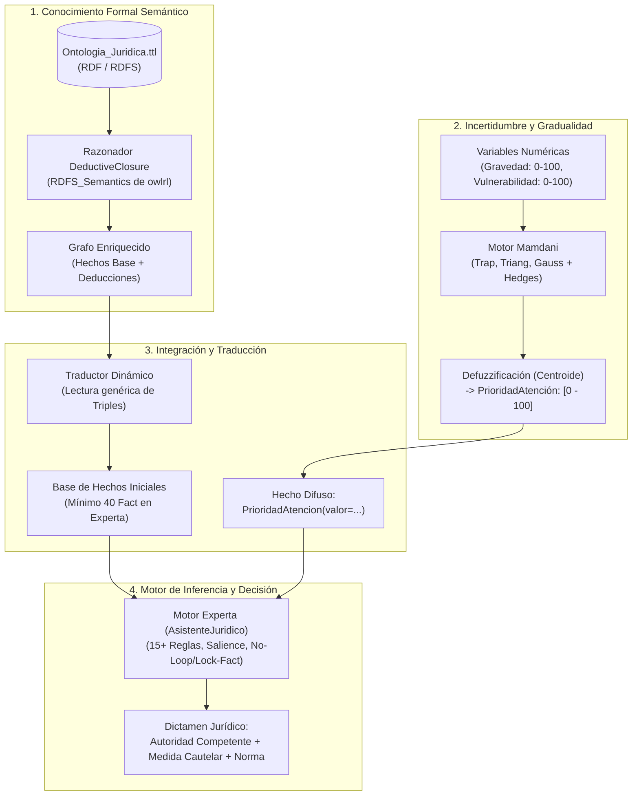
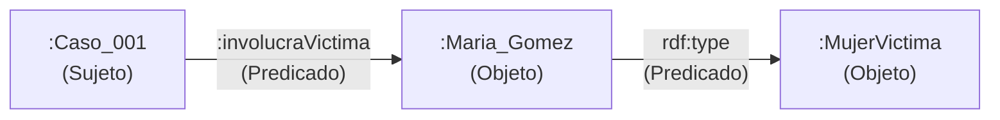
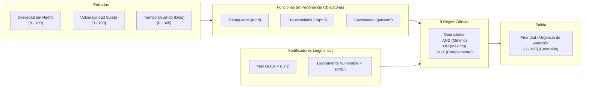
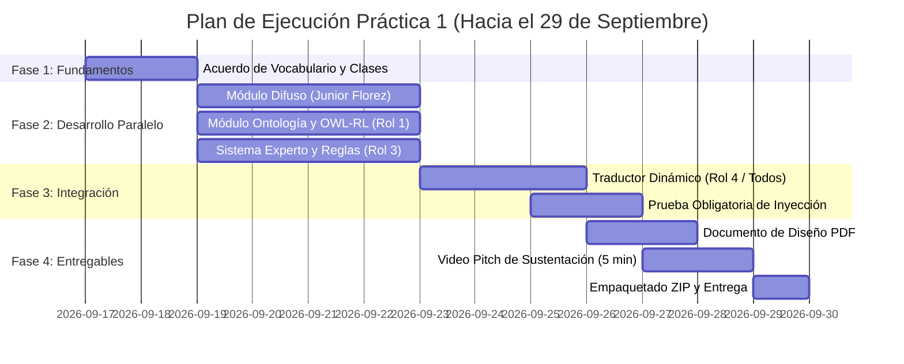

# Plan de la Práctica 1: Sistema Híbrido en Asistencia Jurídica

> **Contexto Académico:** Universidad Nacional de Colombia - Sede Medellín
> **Curso:** Introducción a la Inteligencia Artificial (3010476)
> **Profesor:** Jaime Alberto Guzmán Luna
> **Equipo 5 - Grupo 1:** Luisa Rendón, Jerónimo Hoyos, Juanita Rosero, Junior Florez
> **Fecha Límite:** 29 de Septiembre (9:50 am) | Sustentación: 29 de Sept - 1 de Octubre

---

## 1. Descripción del Problema y Meta

El objetivo del taller es diseñar e implementar un **Sistema Híbrido de Inteligencia Artificial** que combine tres paradigmas clásicos para resolver consultas complejas de asistencia jurídica (arrendamientos, desalojos, violencia intrafamiliar y conflictos territoriales):

1. **Representación del Conocimiento con Ontologías (RDF/RDFS + OWL-RL):** Modela formalmente las entidades legales, jerarquías normativas y relaciones jurídicas, deduciendo hechos implícitos mediante inferencia semántica.
2. **Lógica Difusa (Scikit-Fuzzy):** Cuantifica la incertidumbre, gradualidad y matices del mundo real (nivel de gravedad, vulnerabilidad de la víctima, urgencia de atención).
3. **Sistemas Basados en Reglas (Experta):** Toma decisiones deterministas y emite recomendaciones legales combinando los hechos de la ontología y las variables difusas.



---

## 2. Comparación: Requisitos de la Rúbrica vs. Avance Actual

| Componente                            | Requisito de la Guía Oficial (Prof. Guzmán)                                                                                                                                                                    | Estado en `sistema_hibrido.ipynb`                                                                             | Brecha / Tareas Pendientes                                                                                                                         |
| :------------------------------------ | :------------------------------------------------------------------------------------------------------------------------------------------------------------------------------------------------------------- | :------------------------------------------------------------------------------------------------------------ | :------------------------------------------------------------------------------------------------------------------------------------------------- |
| **Ontología**                         | 10 clases, 5 subClassOf, 10 propiedades con domain/range, 1 subPropertyOf, 4 individuos/clase, serialización Turtle.                                                                                           | **0% completado** (Celdas vacías `# Módulo de Ontología:`).                                                   | Falta todo: diseñar el archivo `.ttl`, instanciar individuos y modelar relaciones.                                                                 |
| **Razonamiento Semántico**            | `DeductiveClosure(RDFS_Semantics)` demostrando 3 casos de inferencia (subclase, dominio/rango, subpropiedad) y +4 afirmaciones deducidas.                                                                      | **0% completado**.                                                                                            | Falta implementar el script de inferencia con `owlrl` y documentar la comparativa antes/después.                                                   |
| **Traductor Ontología $\to$ Experta** | Traductor dinámico sin código cableado que transforme triples en hechos. Prueba obligatoria: agregar triple al `.ttl` y que active reglas sin tocar Python.                                                    | **0% completado**.                                                                                            | Componente crítico pendiente para la integración híbrida.                                                                                          |
| **Lógica Difusa**                     | 3 variables, $\ge 3$ términos c/u, funciones triangulares, trapezoidales y Gaussianas, 2 modificadores lingüísticos (_muy_, _ligeramente_), 9 reglas (AND, OR, NOT), defuzzificación.                          | **~35% completado** (Definió 3 variables: `gravedad`, `vulnerabilidad`, `prioridad_atencion` con sus curvas). | Faltan las **9 reglas difusas**, los **modificadores lingüísticos** con sus fórmulas matemáticas y la **defuzzificación / simulación de control**. |
| **Sistema Experto**                   | 5 clases `Fact`, $\ge 15$ reglas, $\ge 40$ hechos en memoria, 3 niveles de prioridad (_salience_), 3 mecanismos de conflicto (Recency, Specificity, Salience), prevención de bucles (_Lock-Fact_ o _No-Loop_). | **~40% completado** (Definió 5 clases `Fact` y 11 reglas de decisión con 3 niveles de salience: 100, 50, 20). | Faltan 4 reglas (para llegar a 15+), la base de 40 hechos, demostrar _Specificity_ y _Recency_, e implementar _Lock-Fact_.                         |
| **Alimentación Híbrida**              | Las salidas difusas y todos los hechos ontológicos deben ser precondiciones activas en Experta.                                                                                                                | **0% completado**.                                                                                            | Las reglas aún no leen hechos generados por el difuso ni por la ontología.                                                                         |

---

## 3. Desmitificando las Ontologías: Explicación Conceptual para el Equipo

### ¿Qué es una Ontología en Inteligencia Artificial?

En IA clásica, una **ontología** es un modelo explícito, formal y compartido de los conceptos de un dominio y las relaciones que existen entre ellos.
Mientras que una base de datos SQL solo guarda tablas con filas y columnas ("datos mudos"), una ontología guarda **significado semántico** ("conocimiento con lógica").

### 1. El Átomo de la Web Semántica: El Triple RDF

En RDF (_Resource Description Framework_), todo el conocimiento del universo se expresa en oraciones simples de tres elementos:

$$\mathbf{(Sujeto,\; Predicado,\; Objeto)}$$

- **Sujeto:** De quién se habla (una URI que identifica a una entidad, ej. `:Caso_001` o `:Juan`).
- **Predicado:** La propiedad o relación (ej. `rdf:type`, `:tieneDemandado`, `:esSubclaseDe`).
- **Objeto:** Hacia dónde apunta la relación (otra URI o un dato primitivo/Literal, ej. `:Persona`, `"Juan Perez"`).



### 2. Vocabulario y Esquema: RDFS (_RDF Schema_)

RDF por sí solo solo permite enlazar cosas. **RDFS** es el lenguaje que le da estructura lógica y taxonomía:

1. `rdfs:Class`: Define que algo es una clase/categoría (ej. `:Delito`, `:MedidaProteccion`).
2. `rdfs:subClassOf`: Jerarquía de herencia (ej. `:ViolenciaFisica rdfs:subClassOf :DelitoViolento`).
3. `rdfs:domain`: Especifica **quién puede tener** una propiedad (ej. el sujeto de `:tieneLesion` DEBE ser una `:Persona`).
4. `rdfs:range`: Especifica **qué valor toma** una propiedad (ej. el objeto de `:atendidoPor` DEBE ser una `:ComisariaFamilia`).
5. `rdfs:subPropertyOf`: Jerarquía de propiedades (ej. `:agredioFisicamente rdfs:subPropertyOf :violentoA`).

### 3. La Magia del Razonador: Deducción Automática con OWL-RL

El profesor exige usar `DeductiveClosure(RDFS_Semantics)` de `owlrl`. ¿Qué hace esta función?
Aplica reglas lógicas de inferencia formal sobre el grafo para **descubrir verdades que nadie escribió explícitamente**:

```mermaid
flowchart TD
    subgraph Inferencia_Jerarquia["Caso 1: Inferencia por Jerarquía (subClassOf)"]
        H1["Afirmación Explícita:\nSimba es un León\nLeón es subclase de Mamífero\nMamífero es subclase de Animal"]
        R1["Razonador OWL-RL"]
        D1["Deducción Automática:\nSimba es un Mamífero\nSimba es un Animal"]
        H1 --> R1 --> D1
    end

    subgraph Inferencia_Dominio["Caso 2: Inferencia por Dominio/Rango (rdfs:domain)"]
        H2["Afirmación Explícita:\nPropiedad 'denunciaA' tiene dominio 'Victima'\nCaso: Juan denunciaA Pedro"]
        R2["Razonador OWL-RL"]
        D2["Deducción Automática:\nJuan es AUTOMÁTICAMENTE de clase 'Victima'\n(Aunque nunca se le haya declarado rdf:type Victima)"]
        H2 --> R2 --> D2
    end

    subgraph Inferencia_Subpropiedad["Caso 3: Inferencia por Subpropiedad (rdfs:subPropertyOf)"]
        H3["Afirmación Explícita:\n'golpeoA' es subpropiedad de 'agredioA'\nCaso: Carlos golpeoA Ana"]
        R3["Razonador OWL-RL"]
        D3["Deducción Automática:\nCarlos agredioA Ana"]
        H3 --> R3 --> D3
    end
```



---

## 4. Arquitectura Detallada de Cada Componente del Sistema

### 🏛️ Componente 1: Ontología Jurídica (`data/ontologia_juridica.ttl`)

Diseñaremos la ontología para cubrir los tres escenarios del taller: **Vivienda**, **Conflictos Territoriales** y **Violencia Intrafamiliar**.

#### Clases (Mínimo 10 clases requeridas)

1. `:CasoJuridico`
2. `:CasoVivienda` (`rdfs:subClassOf :CasoJuridico`)
3. `:CasoTerritorial` (`rdfs:subClassOf :CasoJuridico`)
4. `:CasoViolenciaIntrafamiliar` (`rdfs:subClassOf :CasoJuridico`)
5. `:Persona`
6. `:Victima` (`rdfs:subClassOf :Persona`)
7. `:Agresor` (`rdfs:subClassOf :Persona`)
8. `:Autoridad`
9. `:AutoridadJudicial` (`rdfs:subClassOf :Autoridad`)
10. `:AutoridadAdministrativa` (`rdfs:subClassOf :Autoridad`)
11. `:MedidaProteccion`
12. `:NormaLegal`

#### Propiedades (Mínimo 10 propiedades con dominio/rango y 1 subPropertyOf)

1. `:involucraPersona` (dominio: `:CasoJuridico`, rango: `:Persona`)
2. `:tieneVictima` (`rdfs:subPropertyOf :involucraPersona`, dominio: `:CasoJuridico`, rango: `:Victima`)
3. `:tieneAgresor` (`rdfs:subPropertyOf :involucraPersona`, dominio: `:CasoJuridico`, rango: `:Agresor`)
4. `:remitidoA` (dominio: `:CasoJuridico`, rango: `:Autoridad`)
5. `:aplicaNorma` (dominio: `:CasoJuridico`, rango: `:NormaLegal`)
6. `:requiereMedida` (dominio: `:CasoJuridico`, rango: `:MedidaProteccion`)
7. `:nombrePersona` (dominio: `:Persona`, rango: `xsd:string`, subpropiedad de `foaf:name`)
8. `:edadPersona` (dominio: `:Persona`, rango: `xsd:integer`)
9. `:descripcionHecho` (dominio: `:CasoJuridico`, rango: `xsd:string`, subpropiedad de `dc:description`)
10. `:fechaDenuncia` (dominio: `:CasoJuridico`, rango: `xsd:date`)

#### Individuos (Mínimo 4 por clase)

Al menos 4 casos por categoría, 4 personas víctimas, 4 agresores, 4 autoridades (`:Fiscalia`, `:ComisariaFamilia`, `:JuzgadoCivil`, `:ICBF`), etc., todos con `rdfs:label`.

---

### 🎛️ Componente 2: Lógica Difusa (`src/difuso/motor_difuso.py`)

El módulo difuso modela variables cuantitativas que no son blanco o negro:



#### Fórmulas de Modificadores Lingüísticos (Requisito de clase):

- **Concentración (_Muy_):** Reduce el grado de pertenencia, exigiendo mayor certeza:
  $$\mu_{\text{muy } A}(x) = [\mu_A(x)]^2$$
- **Dilatación (_Ligeramente_ o _Poco_):** Expande el conjunto difuso:
  $$\mu_{\text{ligeramente } A}(x) = \sqrt{\mu_A(x)}$$

---

### 🧠 Componente 3: Sistema Experto (`src/experto/reglas_juridicas.py`)

Contiene la base de conocimiento y el motor de inferencia en `experta`:

1. **Clases `Fact`:** `Consulta`, `AutoridadCompetente`, `Recomendacion`, `FuenteOficial`, `EvaluacionRiesgo`.
2. **Prioridades (`salience`):**
   - `salience=100`: Casos urgentes de violencia física o abuso (vida o integridad en riesgo inminente).
   - `salience=50`: Casos de vivienda y afectación patrimonial grave.
   - `salience=20`: Conflictos territoriales y trámites administrativos.
3. **Mecanismos de Resolución de Conflictos Demostrados:**
   - **Salience:** La regla con mayor salience se dispara primero en la agenda.
   - **Specificity:** Una regla con más condiciones específicas (ej. `Consulta(categoria='violencia') & EvaluacionRiesgo(urgencia='alta')`) se activa sobre una regla genérica.
   - **Recency:** El hecho declarado más recientemente en la memoria de trabajo tiene precedencia.
4. **Prevención de Bucles Infinitos:**
   - Uso de hecho de bloqueo (**`Lock-Fact`**): al declarar una recomendación, se inserta `Procesado(id=...)` para que la regla no vuelva a coincidir y re-activarse en bucle.

---

### 🔄 Componente 4: Traductor Dinámico Ontología $\to$ Experta (`src/integrador/traductor_ontologia.py`)

> [!IMPORTANT]
> **El Requisito Más Estricto de la Rúbrica:**
> El código del traductor **NO PUEDE CONTENER NOMBRES FIJOS CABLEADOS** (como `engine.declare(Padre('Juan'))`). Debe recorrer dinámicamente el grafo inferido de RDFLib y generar los `Fact` de Experta mediante introspección.

#### Arquitectura del Traductor:

```python
# Pseudocódigo del flujo del traductor
def traducir_grafo_a_experta(grafo_rdf, motor_experta):
    # 1. Ejecutar razonador semántico
    DeductiveClosure(RDFS_Semantics).expand(grafo_rdf)

    # 2. Recorrer triples dinámicamente
    for s, p, o in grafo_rdf:
        # Extraer nombres limpios (sin URI completa)
        sujeto = str(s).split('#')[-1]
        predicado = str(p).split('#')[-1]
        objeto = str(o).split('#')[-1]

        # Mapear tipos a Hechos
        if p == RDF.type and (o, RDF.type, RDFS.Class) in grafo_rdf:
            motor_experta.declare(Fact(entidad=sujeto, tipo_clase=objeto))

        # Mapear propiedades de objeto y literales
        elif p != RDF.type:
            motor_experta.declare(Fact(sujeto=sujeto, relacion=predicado, valor=objeto))
```

#### Caso de Prueba Obligatorio:

Se agregará una nueva línea al archivo `.ttl` (ej. `:Caso_99 a :CasoViolenciaIntrafamiliar ; :tieneVictima :Elena .`). Sin tocar una sola línea de código Python, se correrá el traductor y el motor, y el sistema emitirá el dictamen de protección para Elena automáticamente.

---

## 5. Plan de Acción y Distribución del Trabajo

Para que el equipo de 4 integrantes avance en paralelo:



---

## 6. Plan de Verificación

### Pruebas Automatizadas:

1. `pytest tests/test_ontologia.py`: Verifica que el archivo `.ttl` contenga las $\ge 10$ clases, $\ge 10$ propiedades y que `owlrl` infiera los 4+ hechos requeridos.
2. `pytest tests/test_difuso.py`: Evalúa las funciones de pertenencia, modificadores lingüísticos y que la defuzzificación retorne valores válidos en $[0, 100]$.
3. `pytest tests/test_sistema_experto.py`: Comprueba que las 15+ reglas se activen con prioridades (_salience_), sin bucles infinitos.
4. `pytest tests/test_traductor.py`: Ejecuta el caso de prueba obligatorio agregando un hecho al `.ttl` y verificando su deducción automática.

### Verificación Manual para el Estudiante:

- Inspeccionar visualmente las gráficas de curvas difusas generadas por `matplotlib`.
- Comprobar que en la agenda de Experta se ejecute primero la regla de violencia intrafamiliar antes que la de vivienda o territorial.
