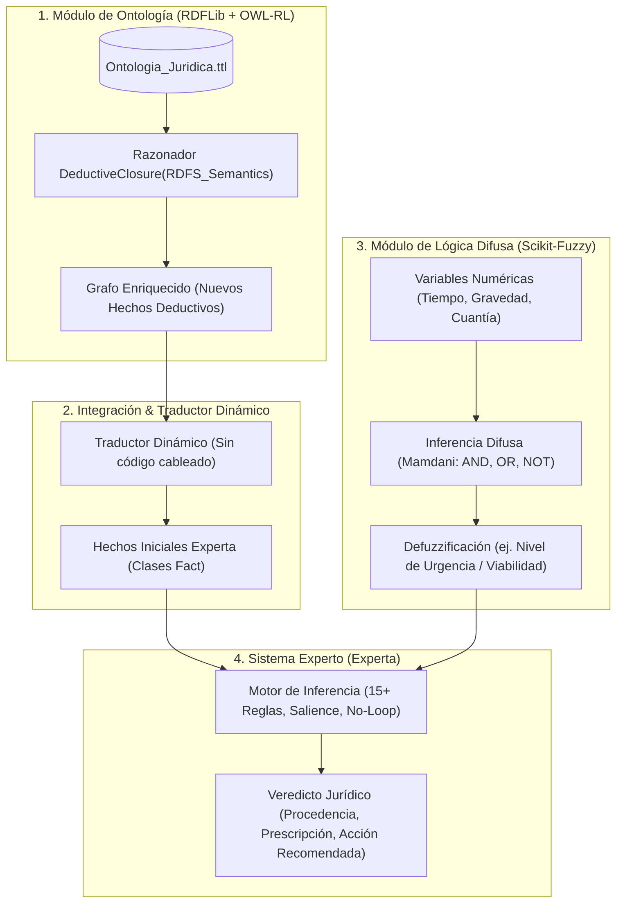

# Plan de Organización y Repartición de Trabajo - Práctica 1 IA: Sistema Híbrido en Asistencia Jurídica

> **Para el estudiante y su equipo:** Este documento establece el estado de conexión al repositorio, el análisis exhaustivo de los requisitos de la rúbrica del profesor Jaime Alberto Guzmán Luna y la propuesta óptima de repartición de trabajo en paralelo para entregar a tiempo y con máxima calificación (29 de Septiembre, 9:50 am).

## 3. Arquitectura del Sistema Híbrido Jurídico

El sistema híbrido resuelve consultas legales (ej. asesoría en demandas laborales, civiles o denuncias penales) combinando el conocimiento formal, la incertidumbre y la lógica deductiva:



---

## 4. Propuesta de Repartición de Trabajo (4 Roles Especializados)

Para trabajar de forma desacoplada en Git sin pisarse el código, se divide el sistema en 4 bloques con contratos de interfaz claros:

### 👤 Rol 1: Especialista en Ontologías y Razonamiento Semántico (25% rúbrica)

_Objetivo: Modelar el conocimiento formal del dominio legal en RDF/RDFS y aplicar inferencias con OWL-RL._

- **Entregables específicos:**
  1. Archivo `ontologia_juridica.ttl` en serialización **Turtle**.
  2. Mínimo **10 clases** (`rdfs:Class`) y **5 jerarquías** (`rdfs:subClassOf`) (ej. `CasoJuridico`, `Demandante`, `Delito`, `MedidaCautelar`).
  3. Mínimo **10 propiedades** con `rdfs:domain`, `rdfs:range` y al menos un `rdfs:subPropertyOf`.
  4. Vocabularios estándar (ej. `foaf:name`, `dc:title`, `xsd:dateTime`).
  5. Mínimo **4 individuos por clase** con `rdfs:label`.
  6. Script que ejecute `DeductiveClosure(RDFS_Semantics)` de `owlrl` y demuestre:
     - Caso 1: Hecho inferido por jerarquía de clases.
     - Caso 2: Hecho inferido por dominio/rango.
     - Caso 3: Hecho inferido por subpropiedad.
     - Comparativa antes/después demostrando al menos 4 nuevos hechos deducidos.

---

### 👤 Rol 2: Especialista en Lógica Difusa e Incertidumbre (15% rúbrica)

_Objetivo: Modelar factores graduales del entorno jurídico usando Scikit-Fuzzy._

- **Entregables específicos:**
  1. Definición de **3 variables difusas de entrada** (ej. `GravedadDelDaño`, `TiempoTranscurridoMeses`, `CuantiaEconomica`) y **1 de salida** (ej. `NivelUrgenciaMedida` o `RiesgoPrescripcion`).
  2. Cada variable con mínimo 3 valores lingüísticos (universos de discurso).
  3. Uso obligatorio de funciones **triangulares**, **trapezoidales** y **Gaussianas**.
  4. Implementación de **2 modificadores lingüísticos** ("muy grave", "ligeramente urgente") con su respectiva fórmula matemática.
  5. Mínimo **9 reglas difusas** con operadores **AND** (intersección), **OR** (unión) y **NOT** (complemento).
  6. Proceso de defuzzificación documentado y justificado (ej. Centroide).
  7. Gráficas de las funciones de pertenencia y superficies de control para el informe.

---

### 👤 Rol 3: Especialista en Sistema Experto (Experta) (25% rúbrica)

_Objetivo: Implementar las reglas de decisión jurídica y los mecanismos de control de inferencia._

- **Entregables específicos:**
  1. Definición de al menos **5 clases de Hechos (`Fact`)** estructuradas en Python.
  2. Base de hechos inicial con **mínimo 40 hechos** del dominio legal.
  3. Mínimo **15 reglas de producción** de asistencia jurídica.
  4. Uso de al menos **3 niveles de prioridad (`salience`)**.
  5. Implementación demostrada de los **3 mecanismos de resolución de conflictos**:
     - _Salience_ (Prioridad explícita).
     - _Specificity_ (Regla con premisas más específicas gana).
     - _Recency_ (Hechos más recientes en la memoria de trabajo).
  6. Mecanismo de prevención de bucles infinitos (**`No-Loop`** o hecho de bloqueo **`Lock-Fact`**).

---

### 👤 Rol 4: Integrador Híbrido, Traductor Dinámico y Documentación (35% rúbrica)

_Objetivo: Unir los tres módulos mediante el traductor obligatorio, liderar el informe de diseño y el video pitch._

- **Entregables específicos:**
  1. **Traductor Ontología → Experta:**
     - Función en Python que recorra dinámicamente el grafo inferido de RDFLib y declare las instancias correspondientes en el motor de Experta.
     - **Caso de prueba obligatorio:** Demostrar que al agregar un nuevo triple al archivo `.ttl`, el traductor lo convierte a `Fact` y dispara las reglas sin tocar una sola línea de código Python.
  2. **Inyección Difusa → Experta:**
     - Pasar el valor defuzzificado como hecho o precondición para las reglas del sistema experto.
  3. **Documento de Diseño (PDF):**
     - Consolidar descripciones, diagramas de clases, gráficas difusas y justificaciones teóricas.
  4. **Video Pitch (YouTube, máx 5 min):**
     - Estructura del guion, coordinación de grabación de los 4 integrantes y edición final.

_(Nota: Si el equipo es de 3 personas, el Rol 4 se distribuye entre los 3 integrantes: Rol 1 asume el traductor, Rol 2 la inyección difusa y Rol 3 consolida el documento)._

---

## 5. Estructura de Archivos Propuesta para el Repositorio

Para que cada integrante trabaje en su propio archivo sin conflictos de merge en Git:

```text
sistema-hibrido-en-asistencia-juridica/
├── docs/
│   ├── compatibilidad_python_experta.md
│   ├── arquitectura_sistema.md
│   └── manual_diseno.pdf
├── data/
│   └── ontologia_juridica.ttl          <-- Rol 1
├── src/
│   ├── __init__.py
│   ├── ontologia/
│   │   ├── __init__.py
│   │   └── razonador_semantico.py      <-- Rol 1
│   ├── difuso/
│   │   ├── __init__.py
│   │   └── motor_difuso.py             <-- Rol 2
│   ├── experto/
│   │   ├── __init__.py
│   │   ├── hechos.py                   <-- Rol 3
│   │   └── reglas_juridicas.py         <-- Rol 3
│   └── integrador/
│       ├── __init__.py
│       └── traductor_ontologia.py      <-- Rol 4 / Integrador
├── tests/
│   ├── test_ontologia.py
│   ├── test_difuso.py
│   ├── test_traductor.py
│   └── test_sistema_experto.py
├── sistema_hibrido.ipynb               <-- Notebook principal que orquesta el demo
├── pyproject.toml
└── README.md
```

---

## 6. Cronograma Sugerido de Trabajo (Hacia el 29 de Septiembre)

| Fase                                                 | Fechas            | Objetivo Principal                                                                                                                     |
| :--------------------------------------------------- | :---------------- | :------------------------------------------------------------------------------------------------------------------------------------- |
| **Fase 1: Asignación y Prototipado Base**            | 16 - 19 Sept      | Repartir roles, crear ramas de feature por integrante y definir el vocabulario común (clases ontológicas, variables difusas y hechos). |
| **Fase 2: Implementación de Módulos Independientes** | 20 - 23 Sept      | Cada integrante termina su módulo individual con sus pruebas unitarias.                                                                |
| **Fase 3: Integración y Traductor Dinámico**         | 24 - 26 Sept      | Conectar Ontología + Difuso -> Sistema Experto en `sistema_hibrido.ipynb` y verificar el caso de prueba obligatorio.                   |
| **Fase 4: Documento PDF y Video Pitch**              | 27 - 28 Sept      | Redacción final del documento de diseño, grabación y subida del video pitch a YouTube.                                                 |
| **Fase 5: Entrega y Sustentación**                   | 29 Sept (9:50 am) | Subida del archivo ZIP a Google Classroom y preparación para la sesión de preguntas.                                                   |
